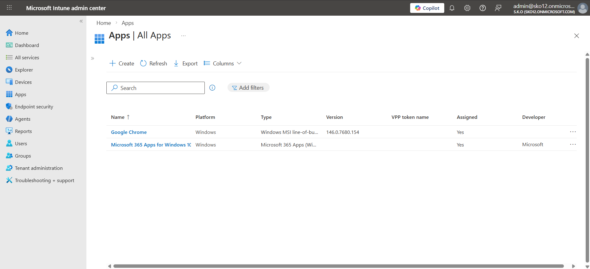

# Windows Autopilot: New Hire Device Provisioning

## Business Context

S.K.O Corporation operates a cloud-first IT environment managed through Microsoft Intune and Microsoft Entra ID. As part of the organisation's modern device management strategy, the IT department implemented Windows Autopilot to streamline the onboarding process for new employees.

Previously, preparing a workstation for a new hire required manual configuration by IT — imaging the device, joining it to the domain, installing applications, and handing it off. This project eliminates that process entirely. With Autopilot, a new employee's device is automatically configured, enrolled into Intune, and ready to use the moment they sign in with their corporate credentials — with no IT intervention at the physical device.

This project documents the full implementation of Windows Autopilot to provision a corporate workstation for **Amanda Mensah**, a new hire at S.K.O Corporation.

---

## Environment

| Component | Details |
|---|---|
| MDM Platform | Microsoft Intune |
| Identity Platform | Microsoft Entra ID |
| Deployment Method | Windows Autopilot — User-Driven |
| Join Type | Microsoft Entra joined (cloud-native) |
| Target Device | PC01 (VirtualBox VM) |
| Tenant | SKO12.onmicrosoft.com |
| End User | Amanda Mensah — New Hire |
| IT Administrator | Yaw Ankoma Owusu-Gyimah |

---

## Project Overview

Amanda Mensah joined S.K.O Corporation and required a fully configured corporate workstation. Rather than manually setting up her device, the IT Administrator leveraged Windows Autopilot to deliver a zero-touch provisioning experience. Upon first boot, Amanda signed in with her corporate credentials and received a fully managed Windows 11 environment — with Microsoft 365 apps and Google Chrome deployed and her device automatically enrolled into Intune — without any hands-on IT configuration at the endpoint.

---

## Implementation Steps

### Step 1 — Hardware Hash Capture and Import

The hardware hash was extracted from the target Windows 11 device using PowerShell and exported as a CSV file:

```powershell
[Net.ServicePointManager]::SecurityProtocol = [Net.SecurityProtocolType]::Tls12
New-Item -Type Directory -Path "C:\HWID"
Set-Location -Path "C:\HWID"
$env:Path += ";C:\Program Files\WindowsPowerShell\Scripts"
Set-ExecutionPolicy -Scope Process -ExecutionPolicy RemoteSigned
Install-Script -Name Get-WindowsAutopilotInfo
Get-WindowsAutopilotInfo -OutputFile AutopilotHWID.csv
```


---

The CSV was imported into Intune via:

> Devices → Enrollment → Windows → Windows Autopilot devices → Import

A manual **Sync** was triggered after import to register the device with the Autopilot service.

---


---

### Step 2 — Autopilot Deployment Profile

A deployment profile was created to define the out-of-box experience for the device:

> Devices → Enrollment → Windows → Deployment Profiles → Create profile → Windows PC

| Setting | Value |
|---|---|
| Profile Name | Windows 11 Profile |
| Deployment Mode | User-Driven |
| Join Type | Microsoft Entra joined |
| License Terms | Hidden |
| Privacy Settings | Hidden |
| User Account Type | Standard User |

---


---

### Step 3 — Dynamic Device Group

A dynamic Entra ID device group was configured to automatically target Autopilot-registered devices and receive the deployment profile:

> Entra ID → Groups → New Group → Dynamic Device

**Group Name:** Windows 11 AP

**Membership Rule:**
```
(device.deviceManufacturer -eq "innotek GmbH")
```
---


---

> **Note:** In a production environment with physical hardware, the standard Autopilot membership rule `(device.devicePhysicalIds -any _ -eq "[ZTDId]")` would be used. The manufacturer-based rule was applied here as a lab-appropriate alternative, since VirtualBox-hosted devices do not carry a ZTDId attribute prior to completing enrollment.

The deployment profile was assigned to this group, ensuring any matching device automatically receives the Autopilot configuration.

---

### Step 4 — Profile Assignment Verified

Once the device was Entra joined and appeared in the dynamic group, the Autopilot device list was synced:

> Devices → Enrollment → Windows → Windows Autopilot devices → Sync

The profile status updated from **Not assigned** to **Assigned**, confirming the device was ready for Autopilot provisioning.

---


---

### Step 5 — Application Deployment

To ensure Amanda's workstation arrived with the necessary productivity and browsing tools pre-installed, two applications were deployed through Intune before the device completed provisioning:

> Apps → All Apps → Add

**Microsoft 365 Apps for Windows 10 and later**

| Field | Value |
|---|---|
| Type | Microsoft 365 Apps (Windows) |
| Suite | Word, Excel, Outlook, Teams |
| Assigned | Yes — Windows 11 AP group |

Microsoft 365 was configured as a **Required** app assignment, meaning it installs automatically on any device in the group without user interaction.

**Google Chrome (Enterprise)**

| Field | Value |
|---|---|
| Type | Windows MSI line-of-business |
| Version | 146.0.7680.154 |
| Package | googlechromestandaloneenterprise64.msi |
| Assigned | No — pending assignment |

Google Chrome was uploaded as a line-of-business MSI app. Once assigned to the device group, it will deploy silently during or after the Autopilot provisioning process.

Both applications are managed centrally through Intune, allowing the IT Administrator to push updates, monitor install status, and remove apps remotely without touching the device.

---



---

### Step 6 — OneDrive Configuration Policy

To ensure Amanda could access her files from any corporate device, a configuration profile was created in Intune to automatically configure OneDrive Known Folder Move and silent sign-in:

> Devices → Configuration → Create profile → Windows 10 and later → Settings catalog

**Profile Name:** SKO OneDrive Configuration

The following OneDrive settings were configured:

| Setting | Value |
|---|---|
| Silently move Windows known folders to OneDrive | Enabled |
| Show notification to users after folders have been redirected | No |
| Tenant ID | SKO12 Tenant ID |
| Use OneDrive Files On-Demand | Enabled |
| Silently sign in users to the OneDrive sync app with their Windows credentials | Enabled |

With this policy in place, Amanda's Desktop, Documents, and Pictures folders are automatically backed up and synced to OneDrive. If she signs into any other corporate device, her folders are immediately available without any manual setup.

The profile was assigned to the **Windows 11 AP** dynamic device group, ensuring it applies automatically to all Autopilot-provisioned devices.

---


---

### Step 7 — Autopilot Provisioning

With the profile assigned, an Autopilot reset was initiated on the device:

> Settings → System → Recovery → Reset this PC → Remove everything → Local reinstall

On reboot, the device contacted the Autopilot service, retrieved the deployment profile, and presented the customised OOBE. Amanda Mensah signed in with her corporate credentials and the device was automatically enrolled into Intune under her account.

---


---

## Result

The device was successfully provisioned through Windows Autopilot with no manual IT configuration at the endpoint. The final device record in Intune confirmed:

| Field | Value |
|---|---|
| Device Name | PC01 |
| Primary User | Amanda Mensah |
| Enrolled By | Yaw Ankoma Owusu-Gyimah |
| Ownership | Corporate |
| Compliance | Compliant |
| Last Check-in | 03/23/2026, 3:39 AM |

Amanda received a fully managed, corporate-ready workstation with Microsoft 365 applications pre-deployed — delivered entirely through an automated provisioning pipeline.

---


---

## Skills Demonstrated

- Windows Autopilot device registration via hardware hash import
- Intune deployment profile creation and assignment
- Microsoft Entra ID dynamic device group configuration and membership rule authoring
- Application deployment via Intune — Microsoft 365 Apps and line-of-business MSI packaging
- Zero-touch, cloud-native device provisioning (no on-premises dependency)
- OneDrive Known Folder Move configuration via Intune Settings Catalog
- Automated OneDrive silent sign-in for seamless user experience across devices
- End-to-end modern endpoint management aligned with Microsoft's cloud-first guidance
- New hire onboarding automation via Microsoft Intune and Windows Autopilot
